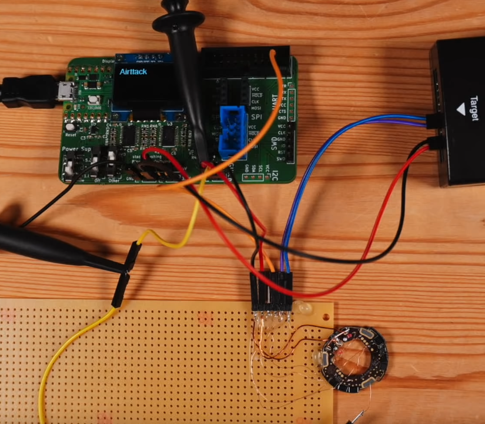
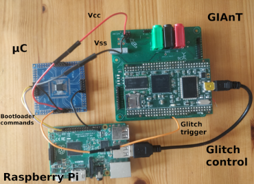

# The Problem

<!-- - Embedded systems play an increasingly common role in our lives, in devices such as watches, cars and medical imaging systems (to name a few). -->
<!--   - Many embedded systems are based on microcontroller units (MCUs) (integrated CPU, memory and I/O peripherals). -->
- Microcontroller (MCU for microcontroller unit) firmware is often protected "in the wild", in order to protect intellectual property and prevent discovery of software vulnerabilities.
  - This is typically done by disabling debug access or revoking read access to flash memory in the bootloader.
\linebreak
- There are many reasons this can be seen as a problem (according to David Oswald's security module slides):
  - You may want to look for software vulnerabilities
  - Reverse-engineer a proprietary protocol
  - Develop replacement firmware
  - Re-purpose end-of-life devices
<!-- - Voltage glitching is an implementation attack that can be used to skip or incorrectly execute a particular operation by "injecting" a short pulse into the microcontroller at the time the operation is likely to happen. -->

# Related Work: AirTags

- Roth (2021), a.k.a. stacksmashing, has shown how the nRF52832 in Apple AirTags can be glitched to skip its Code Readout Protection (CRP) and dump the firmware.
  - Roth also cites LimitedResults, a blog detailing similar work on the nRF52840.

\center {width=50%}

# Related Work: "Fill your Boots"

- Van den Herrewegen et al. (2020) describe voltage glitching in conjunction with binary analysis for three different microcontrollers.
  - The above paper also includes some information about GIAnT, a board made by David Oswald to facilitate voltage glitching.

\center {width=50%}

# Related Work: "Shaping the glitch"

- Bozzato, Focardi and Palmarini (2019) voltage glitch six MCUs and add their own waveform shape glitch parameter with findings.
  - A genetic algorithm is used to search the parameter space.

# The Plan: Semester One

- **By now (from proposal):** I had planned to have made contributions to GIAnT codebase for nRF52832 by now (12/11/2021) but haven't successfully glitched it yet.
- **30th Nov 2021 (was the 19th):** To have tested and compiled success rates for glitching nRF52832 with various parameters (delay, pulse width).
- **10th Dec 2021:** To have started researching and reading datasheet for glitching CC2541 (or any common MCU with no documented glitch).

# The Plan: Semester Two

- **21st Jan 2022:** To have successfully glitched CC2541 and written notes on findings.
- **25th Feb 2022:** To have investigated ways to automate voltage glitching effectively with MCUs without documented glitch successes. Use findings to propose security mitigations.
- **11th Apr 2022:** To have finished the report for final submission.

# Progress

- I've enabled APPROTECT on the nRF52832.
<!-- blocks debugger from R/W access to all CPU registers and memory-mapped addresses -->
- Communicated successfully with the Pico Debug'n'Dump to glitch based on a delay and pulse width.
- Investigated, with an oscilloscope, where the glitch should be and changed the delay.
  - ...and seen how it's not shorting the CPU power at all!
- I'm in the process of finding out what proportions of lack of understanding and broken Debug'n'Dump I have.

# References

- **Roth, T. (2021)** How the apple AirTags were hacked. https://www.youtube.com/watch?v=\_E0PWQvW-14
- **LimitedResults (2020)** nRF52 debug resurrection (APPROTECT bypass) part 1. LimitedResults. https://limitedresults.com/2020/06/nrf52-debug-resurrection-approtect-bypass/
- **Van den Herrewegen, J. et al. (2020)** ‘Fill your boots: Enhanced embedded bootloader exploits via fault injection and binary analysis’, IACR Transactions on Cryptographic Hardware and Embedded Systems, pp. 56-81
- **Bozzato, C., Focardi, R. and Palmarini, F. (2019)** ‘Shaping the glitch: Optimizing voltage fault injection attacks’, IACR Transactions on Cryptographic Hardware and Embedded Systems, pp. 199–224
